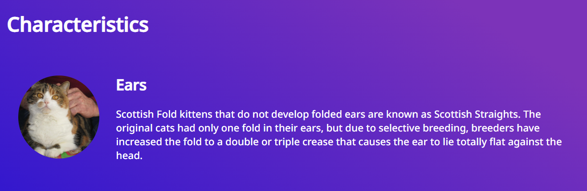
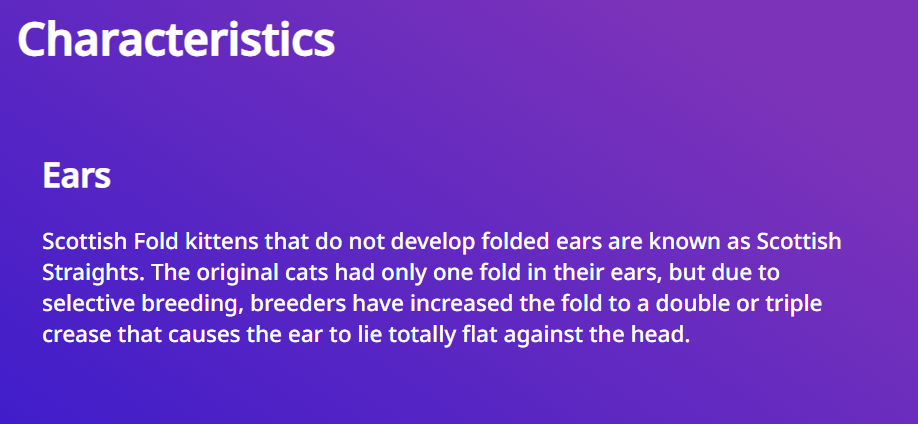
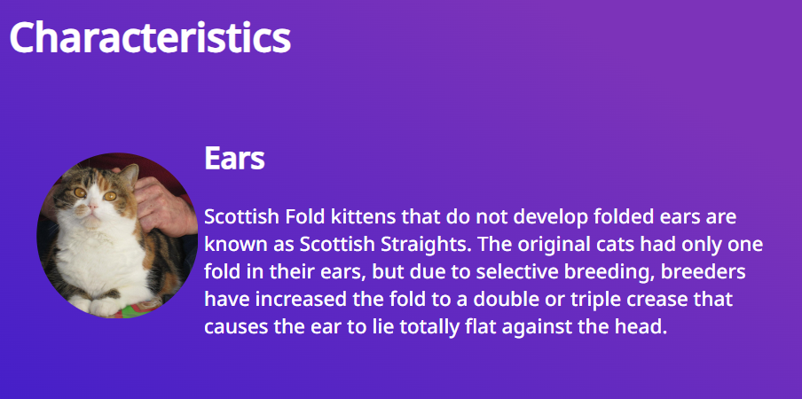

## Code Review Exercise


Write your code review here in markdown format. 

The first code review, it is regarding the hash movement through the page, other than that it is the Top bar navigation.
The main issue was that the hash wasn't being cleared, in that it caused the html body to not move through the page only after a couple of clicks.

What is needed:
- A javascript code used with the onclick html element/etc.
- The onclick event must be added to the nav locations.
- The hash must be cleared to change to ensure working results.

Code view before change:

```html
<li class="nav-list-item">
            <a
              href="#Introduction"
              class="nav-link hover-transition"
              >Introduction</a
            >
```
New code
```html
<li class="nav-list-item">
            <a
              onclick="hash()"
              href="#Introduction"
              class="nav-link hover-transition"
              >Introduction</a
            >
```
- Do the rest of the elements in the nav list item

Javascript code.
The javascript code will reset the hash through the function.

```js
function hash() {
  location.hash = "";
}
```

The second code review has to do with HTML and CSS; memory is lost when converted into a smaller screen display-- review the fourth review if this does not count.

Issue
- Fullscreen
 	

- Smaller Screen
  	

 The fix result is on the small screen.

- Fullscreen, No change.

- Smaller Screen
   	

CSS code

The code in CSS. Instead of allowing the block to be displayed as none, it is displayed as a block. To ensure no data is lost to the clients/users with small screens.

```CSS
.characteristics-image {
    display: inline-block;
    padding: 5px;
  }
```
- As a note, there are better ways to display an image than just to display it as a block.

Third Problem.

- This third problem is regarding the lack of information on the button, which might be needed for people who use listing web elements to navigate through the web.

Before fix
```html
<div class="space-between-distributed-row-container">
              <h3>Origin</h3>
              <button
                class="close-popup-button"
              >
```

After fix
```html
<div class="space-between-distributed-row-container">
              <h3>Origin</h3>
              <button
                class="close-popup-button"
                aria-label="close popup window"
                title="close popup window"
              >
```


The Fourth problem

The form is not set up correctly, and it does not allow the form to be submitted or restarted.

How it was fixed
- The buttons were placed outside of the form, which was placed inside.
- Other than that, a few elements were missing, like the fieldset and legend.

The fix is
- fieldset and legend were added.
```html
<form id="RequestInfo" class="content-container form">
        <fieldset>
          <legend><h1>Tell us what you want to learn more</h1></legend>
          <div
```

- The buttons and functionality are fixed.
```html
            <input class="form-button" type="submit" value="submit" />
            <input class="form-button" type="reset" value="reset" />
          </div>
        </fieldset>
      </form>
```
The form was ended before the two buttons were added. So the form was removed from above being above the buttons to below-- the form is added below/after the inputs/elements of the form buttons were placed.


Name: Ahmed Al-Badri

Class: Html web.

Topic: Reviewing another's work.
